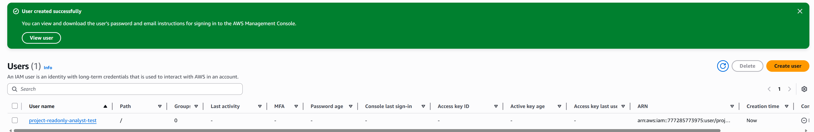
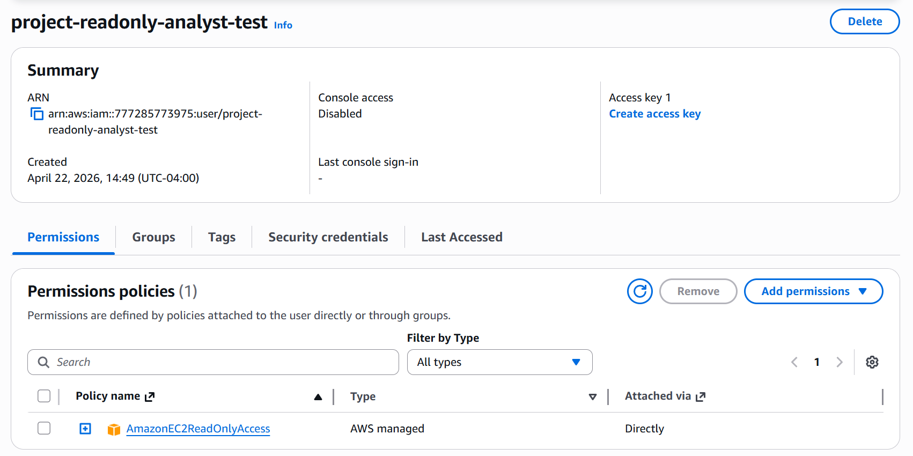
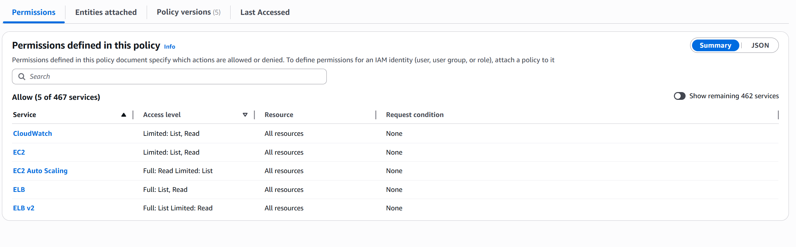
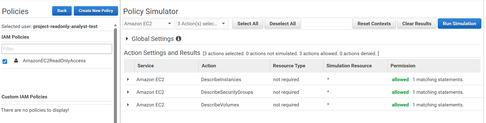
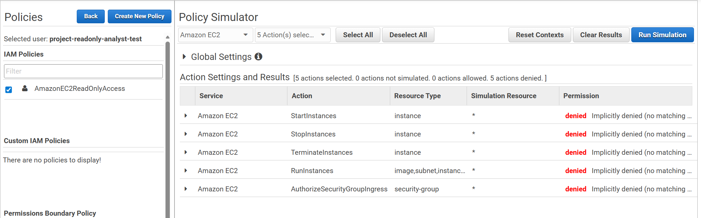
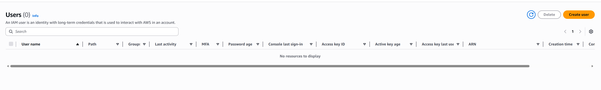

# AWS IAM Least-Privilege Testing Lab

## Objective

The objective of this project was to create a small AWS IAM security lab to test least-privilege access. The goal was to create a controlled test IAM user, attach a limited read-only policy, review the permissions granted by that policy, and validate which actions were allowed or denied using IAM Policy Simulator.

This project focused on IAM permission auditing, least-privilege access validation, policy testing, and secure cleanup without deploying AWS infrastructure or using CloudTrail.

## Scenario Summary

A test IAM user was created to represent a read-only analyst-style account. The user was assigned the AWS managed policy `AmazonEC2ReadOnlyAccess`.

The policy was reviewed to understand what services and access levels were granted. IAM Policy Simulator was then used to test whether the user could perform read-only EC2 actions and whether higher-risk actions such as starting, stopping, terminating instances, launching instances, or modifying security group rules were denied.

After the testing was completed, the test IAM user was deleted to avoid leaving unused identities in the AWS account.

## Tools Used

- AWS IAM
- AWS Managed Policies
- AmazonEC2ReadOnlyAccess policy
- IAM Policy Simulator
- AWS Management Console
- Screenshot documentation
- Markdown reporting

## Test Identity

| Field | Value |
|---|---|
| IAM User | `project-readonly-analyst-test` |
| Console Access | Disabled |
| Access Keys | Not created |
| Attached Policy | `AmazonEC2ReadOnlyAccess` |
| Policy Type | AWS Managed Policy |
| Project Focus | Least-privilege permission testing |

## IAM User Creation

A test IAM user named `project-readonly-analyst-test` was created in AWS IAM. Console access was disabled and no access keys were created.

This reduced risk because the user was only created for permission testing and was not intended for actual login or programmatic AWS access.

## Attached Policy

The AWS managed policy `AmazonEC2ReadOnlyAccess` was attached directly to the test user.

This policy was selected because it provides read-only visibility into EC2-related resources without granting permission to create, modify, stop, start, terminate, or delete infrastructure.

## Policy Permission Review

The policy permissions summary showed access to a limited set of AWS services, including:

| Service | Access Level |
|---|---|
| CloudWatch | Limited: List, Read |
| EC2 | Limited: List, Read |
| EC2 Auto Scaling | Full: Read, Limited: List |
| ELB | Full: List, Read |
| ELB v2 | Full: List, Limited: Read |

The policy allowed visibility into infrastructure resources but did not provide full administrative access. This supports the principle of least privilege because the user could review resources without being able to modify or delete them.

## Permission Testing Methodology

IAM Policy Simulator was used to test two categories of actions:

1. Read-only actions that a security analyst may need for visibility.
2. Write/admin actions that should be denied for a read-only analyst account.

The expected result was:

- Read-only actions should be **allowed**
- Modification or destructive actions should be **denied**

## Allowed Action Test Results

The following EC2 read-only actions were tested and allowed:

| Service | Action | Result | Reason |
|---|---|---|---|
| Amazon EC2 | `DescribeInstances` | Allowed | Allows visibility into EC2 instances |
| Amazon EC2 | `DescribeSecurityGroups` | Allowed | Allows review of security group configurations |
| Amazon EC2 | `DescribeVolumes` | Allowed | Allows visibility into storage resources |

These results confirm that the test user had appropriate read-only visibility into EC2 resources.

## Denied Action Test Results

The following higher-risk EC2 actions were tested and denied:

| Service | Action | Result | Reason |
|---|---|---|---|
| Amazon EC2 | `StartInstances` | Denied | User should not modify instance state |
| Amazon EC2 | `StopInstances` | Denied | User should not modify instance state |
| Amazon EC2 | `TerminateInstances` | Denied | Destructive action that could remove infrastructure |
| Amazon EC2 | `RunInstances` | Denied | User should not launch new AWS resources |
| Amazon EC2 | `AuthorizeSecurityGroupIngress` | Denied | User should not modify inbound network access |

These denied results confirm that the user could not perform administrative or infrastructure-changing actions.

## Key Findings

- The IAM test user was successfully created for controlled permission testing.
- Console access was disabled and no access keys were created, reducing unnecessary access risk.
- The `AmazonEC2ReadOnlyAccess` policy gave the user read-only visibility into EC2-related services.
- IAM Policy Simulator confirmed that read-only EC2 actions such as `DescribeInstances`, `DescribeSecurityGroups`, and `DescribeVolumes` were allowed.
- IAM Policy Simulator confirmed that higher-risk EC2 actions such as `StartInstances`, `StopInstances`, `TerminateInstances`, `RunInstances`, and `AuthorizeSecurityGroupIngress` were denied.
- The permission set followed least-privilege principles for a read-only analyst-style role.
- The test IAM user was deleted after testing to avoid leaving unused identities in the AWS account.

## Evidence Screenshots

## CloudTrail Note

CloudTrail Event History was reviewed during the project, but IAM-related events such as user creation and policy attachment were not visible under the available filters during the lab window.

Because the required CloudTrail events were not available, this project focused on IAM permission validation using IAM Policy Simulator and least-privilege access testing.

## Security Recommendations

- Use least-privilege permissions for analyst accounts.
- Avoid granting administrator access when read-only visibility is enough.
- Disable console access when it is not required.
- Avoid creating access keys unless programmatic access is necessary.
- Regularly review attached IAM policies.
- Use IAM Policy Simulator to validate allowed and denied actions before assigning permissions.
- Separate read-only analyst roles from administrator roles.
- Remove test users after completing lab work.
- Review IAM identities regularly to detect unused or unnecessary accounts.

## Cleanup

After testing, the IAM test user was deleted. This ensured that the AWS account did not retain an unused identity after the lab was completed.

Cleanup actions included:

- Confirming the test user was no longer needed.
- Deleting the IAM user.
- Confirming the IAM user list showed no remaining test user.
- Confirming no access keys were created during the project.

## Verdict

The IAM permission configuration successfully followed least-privilege principles. The test user was able to perform read-only EC2 visibility actions but was denied higher-risk administrative actions.

This demonstrates a secure approach to creating limited analyst-style access in AWS.

## Lessons Learned

This project showed how IAM permissions can be reviewed and validated without deploying infrastructure. IAM Policy Simulator is useful for confirming whether a user can or cannot perform specific AWS actions.

The lab also demonstrated why least privilege is important. A security analyst may need visibility into resources, but they should not automatically receive permission to start, stop, terminate, launch, or modify infrastructure unless those actions are required for their role.

This project also reinforced the importance of cleanup. Test users and temporary permissions should be removed after lab work to reduce unnecessary security risk.
